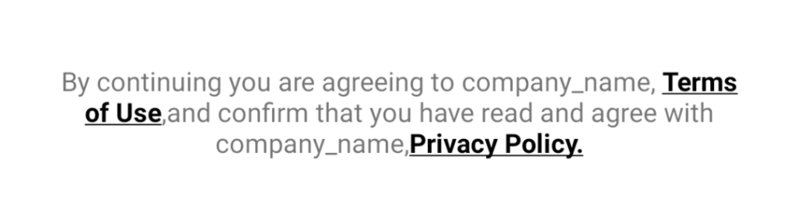

# CustomSpanStrings

CustomSpanString is a class which you can use for applying multiple spans in single textview the spans you can use for Bold, Underline, Color and Clickable


#Usage
```kotlin

val termsOfUseLink = "Terms of Use"
val privacyPolicy = "Privacy Policy."
val completeString = "By continuing you are agreeing to company_name, $termsOfUseLink,and confirm that you have read and agree with company_name,$privacyPolicy"

CustomSpanStrings()
.setCompleteString(completeString)
.setStrings(termsOfUseLink, privacyPolicy)
.setClickableSpan(object : ClickAbleCustomSpanListener {
  override fun onClickSpan() {
    Toast.makeText(context, "Toast New", Toast.LENGTH_SHORT).show()
  }
})
.setBoldSpan()
.setUnderlineSpan()
.setColorSpan(Color.BLACK, Color.BLACK)
.setTextView(termsAndCondn)
.build()
```

#Bold
```kotlin
setBoldSpan()
```

#Underline
```kotlin
setUnderlineSpan()
```

#Color
this function accepts multiple arguments and it is based on your strings if you give multiple strings to a ```setStrings(varOne,varTwo)``` then the color will span will applied according to your strings variable
```kotlin
setColorSpan(Color.BLACK, Color.BLUE)
```

#Apply on TextView
Give your TextView to this function
```kotlin
.setTextView(termsAndCondn)
```

#Clickable
To click on a particular string from yur complete string this function will be used
```kotlin
.setClickableSpan(object : ClickAbleCustomSpanListener {
  override fun onClickSpan() {
    Toast.makeText(context, "Toast New", Toast.LENGTH_SHORT).show()
  }
})
```

#Strings you want to apply spans
this function able to receive multiple params
```kotlin
.setStrings(termsOfUseLink, privacyPolicy)
```

#Complete String
```kotlin
.setCompleteString(completeString)
```

#Build
For applying all spans and set to your textview
```kotlin
.build()
```


